# Augmentation Effects on Distracted Driver Detection

Inspired by State Farm's [Distracted Driver Detection Challenge](https://www.kaggle.com/competitions/state-farm-distracted-driver-detection/data), we build a system to classify images of drivers into 10 classes categorized by the drivers' activities while behind the wheel. 

## Scope and Purpose

When initially inspecting the data, we hypothesized that a main issue for many modern classification models would be overfitting to the training data by building reliances on environmental characterics such as car interiors or driver-specific attributes, rather than capturing actual generalizable signal from driver activities. 
As such, our focus for this project is to assess whether we can regularize for this, augmenting the training images in different ways to effectively deter the model from relying on the image environments. 

## Data

We utilize data provided for the State Farm challenge: a training set of 22,424 images of drivers taken from the interior of the car. 
The data is produced from controlled experiments where cars are being pulled by a truck, allowing 26 individual participants ("subjects", "drivers") to pretend to drive a car while engaging in activities according to the 10 classes. 
This means that, while the dataset is large, many of the observations are not independent, essentially existing in 26 separate groups defined by common drivers and car interiors. 

The challenge also provides an even larger test dataset, but as this is without labels, includes an unknown number of processed decoy images, and mostly only useful for predictions to obtain a leaderboard score for the challenge, we omit the use of this set for our analysis. 
Our focus is inherently a task of comparing different data processing approaches, and we thus find it sufficient to rely on cross-validation metrics to assess differences. 

### Labels

The training data is categorized into 10 distinct activity classes:

|Class Code|Class Description|# Observations|
|---|---|---|
|c0|safe driving|2489|
|c1|texting - right|2267|
|c2|talking on the phone - right|2317|
|c3|texting - left|2346|
|c4|talking on the phone - left|2326|
|c5|operating the radio|2312|
|c6|drinking|2325|
|c7|reaching behind|2002|
|c8|hair and makeup|1911|
|c9|talking to passenger|2129|

We observe that the label distribution is sufficiently balanced for us to assume cross-entropy loss and accuracy will serve as meaningful metrics without class weighting or resampling. 

**Examples of Different Classes for the same Driver:**

<table>
  <tr>
    <td align="center"><br>c0: safe driving</td>
    <td align="center"><br>c1: texting - right</td>
    <td align="center"><br>c2: talking on phone - right</td>
    <td align="center"><br>c3: texting - left</td>
    <td align="center"><br>c4: talking on phone - left</td>
  </tr>
  <tr>
    <td align="center"><br>c5: operating radio</td>
    <td align="center"><br>c6: drinking</td>
    <td align="center"><br>c7: reaching behind</td>
    <td align="center"><br>c8: hair and makeup</td>
    <td align="center"><br>c9: talking to passenger</td>
  </tr>
</table>

## Methodology

### Model

We choose to employ a [ResNet18](https://arxiv.org/abs/1512.03385) [1] convolutional neural network (CNN) as our base model. 
The model is pre-trained on the [ImageNet](https://www.image-net.org) image database, and is both relatively computationally efficient and capable for our purpose. 
its depth is fairly shallow when compared to other, larger ResNet variants, which we believe is beneficial to avoid overfitting to this highly specific image domain.

We replace the models original classification head with a custom one, characterized by:

1. A first dropout layer with $p=0.3$, 

2. A 256-unit fully connected ReLU activation layer, 

3. A second dropout layer with $p=0.2$,

4. A final classification layer projecting to the 10 output classes. 

We train all layers end-to-end during fine-tuning to enable the pre-trained convolutional parameters to adapt sufficiently to the domain. 

### Training

We train the model configurations using the Adam optimizer [2], defined with a 1e-4 learning rate and a 1e-4 weight decay to minimize the cross-entropy loss. 

To keep computation tractable while being able to observe convergence trends, each fold trains a model for 10 total epochs, with batches of 64 images being injected at a time. 

As we intend to evaluate the generalization abilities of the model when fine-tuned on differently augmented training images, we employ 5-fold grouped cross-validation. 
Crucially, we group by subjects to avoid leaking environmental features into the validation data and inflating performance.
As no single driver will appear in both the training and validation data within a given fold, we hope to enforce the model's ability to generalize across new identities and environments. 
With this cross-validation strategy, we report summary metrics for a configuration as the average across all five folds. 

### Augmentations

We modify the training images using four distinct augmentation methods:

1. **Rotation** of degrees uniformly sampled from [-10, 10] and [-20, 20] to introduce invariance to camera angles.

2. **Cropping** at scale uniformly sampled from [0.8, 1.0] to introduce invariance to zoom.

3. **Color Jitter** of brightness and contrast, both uniformly sampled within [0.8, 1.2] to introduce invariance to lighting conditions.

4. **Random Erasure** [3] of patches covering between 2% and 20% of the image area, with probability $p=0.5$ to ensure reliance on distributed features rather than individual prominent regions.

We isolate the effects of each individual method with a one-at-a-time (OAT) design.
Combined with a no-augmentation baseline and one "fully augmented" setup, we define seven total configurations:

|Config ID|Rotation Degrees|Crop Scale|Color Jitter|Erasure Scale|Erasure $p$|Description|
|---|---|---|---|---|---|---|
|1|0|1|0|0|0|Baseline|
|2|[-10, 10]|1|0|0|0|Light rotation|
|3|[-20, 20]|1|0|0|0|Heavy rotation|
|4|0|[0.8, 1.0]|0|0|0|Random crop|
|5|0|1|[0.8, 1.2]|0|0|Color jitter|
|6|0|1|0|[0.02, 0.2]|0.5|Random erasure|
|7|[-20, 20]|[0.8, 1.0]|[0.8, 1.2]|[0.02, 0.2]|0.5|Fully augmented|

**Examples of Different Augmentation Configurations for the same Image:**

<table>
  <tr>
    <td align="center"><br>1: Baseline</td>
    <td align="center">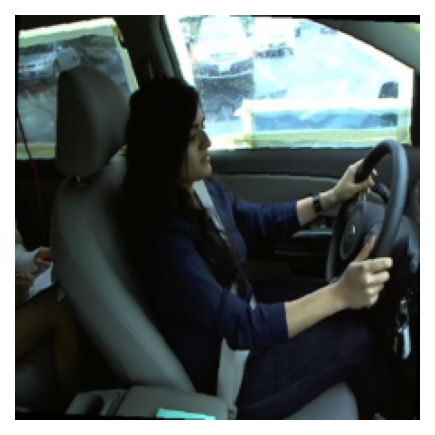<br>2: Light rotation</td>
    <td align="center">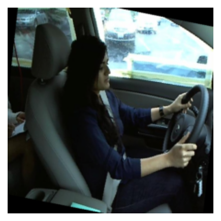<br>3: Heavy rotation</td>
  </tr>
  <tr>
    <td align="center">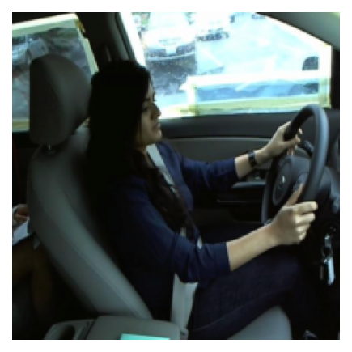<br>4: Random crop</td>
    <td align="center">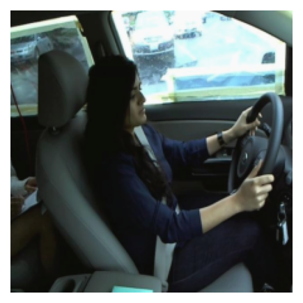<br>5: Color jitter</td>
    <td align="center">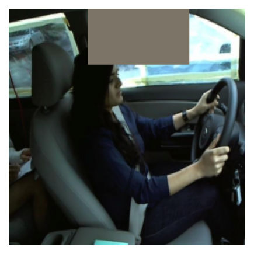<br>6: Random erasure</td>
  </tr>
  <tr>
    <td align="center">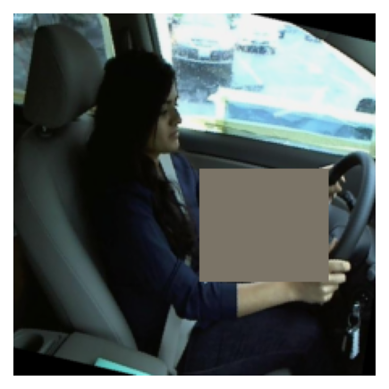<br>7: Fully augmented</td>
  </tr>
</table>

### Evaluation Metrics

We choose to report average validation cross-entropy as our primary evaluation metric, using the loss to select the best checkpoint within each fold. 

We also include validation accuracy as a secondary, more interpretable metric. 

Within each configuration and fold, we track metrics per epoch to later inspect training and convergence across strategies. 

## Results

### Summary Metrics

Our achieved average validation loss and accuracy metrics, at best-loss checkpoint, are as shown below:

<table>
  <tr>
    <td>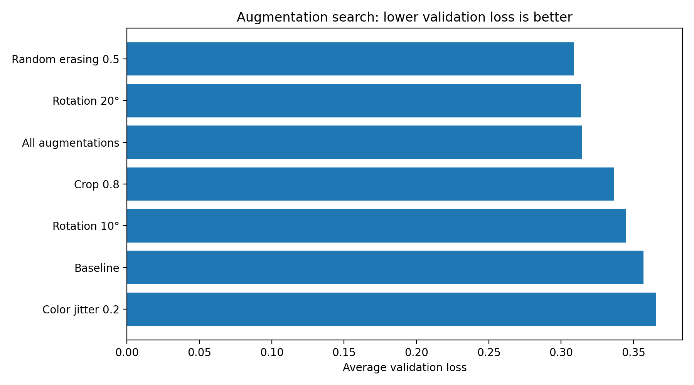</td>
    <td>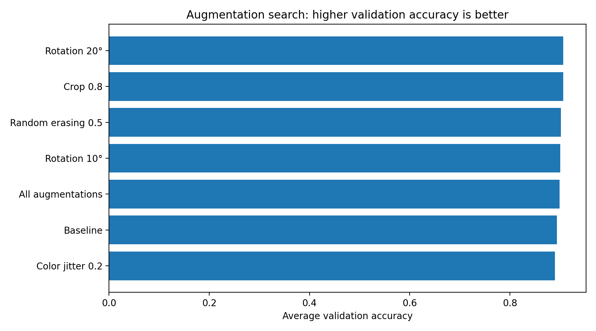</td>
  </tr>
</table>

We find random erasing to produce the lowest average validation loss at approximately 0.308, followed by heavy rotation at approximately 0.313 and full augmentation at approximately 0.315.
Contrarily, the baseline and color-jitter configurations achieves the highest validation losses.
This suggests that augmenting only the images' colors is of little benefit for this task, likely because the signal which allows the model to discriminate between classes is highly structural rather than chromatic. 

The absolute differences in validation accuracy are small, as all configurations achieve between approximately 0.93 and 0.96, while the relative ranking of configurations largely follows the loss results, with heavy rotation and crop performing best.

### Training Dynamics

The average validation losses for all model configurations across epochs are as shown in the plot below:

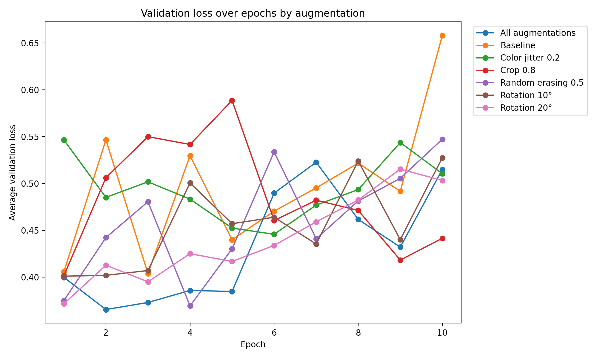

We see that most configurations start near the same validation loss (between 0.35 and 0.40) at epoch, except for color jitter starting at approximately 0.55. 
The baseline shows the most extreme upwards trends, climbing to above 0.65 by epoch 10, while the full augmentation and rotation configurations maintain more stable, lower loss curves throughout the training.

### Overfitting

All configurations seem to severely overfit to the training data with large gaps between training and validation loss: training loss generally drops to zero within two epochs, while validation loss remains significantly higher. 
This is somewhat expected given the grouped cross-validation where models are always evaluated on unseen drivers and car interiors. 

The amount of overfitting does however vary meaningfully between configurations, most noticeable when comparing the baseline and fully augmented configurations:

<table>
  <tr>
    <td align="center">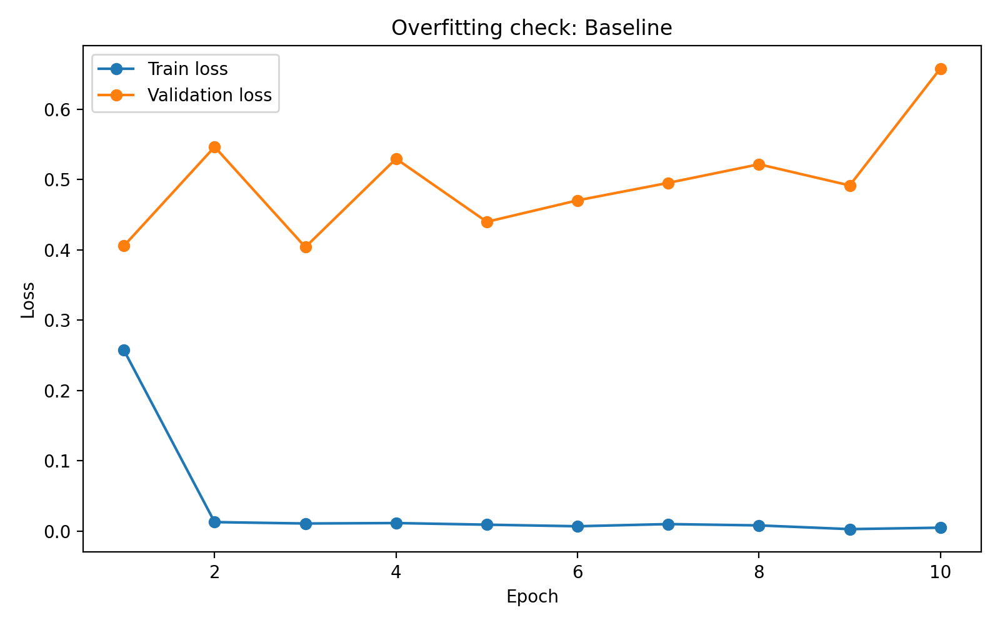</td>
    <td align="center">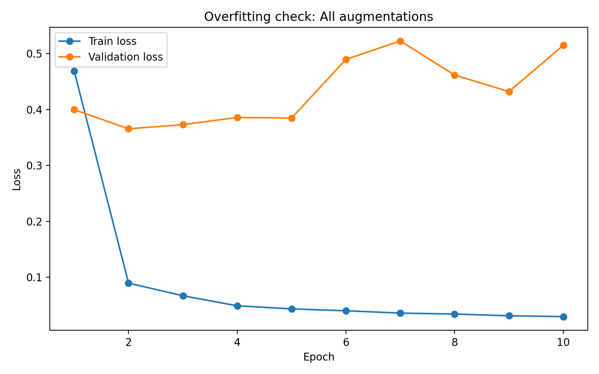</td>
  </tr>
</table>

The baseline hits near-zero training loss at epoch 2 while its validation loss steadily reaches approximately 0.65, indicating that it heavily memorizes the environment characteristics of the training images. The fully augmented model starts with a higher training loss that also descends more gradually (remaining above 0.03 at epoch 10), and its validation loss both lower and more stable than the baseline's. 
This makes it evident that the heavy augmentation has to a higher degree challenged the model during training, but made it more robust to varying environments. Fully augmenting the training images seems to have slowed down memorization and improved generalization.

Random erasure is the best single-augmentation approach in terms of validation loss, and similarly to the full augmentation model, its training loss stays higher than the baseline's:

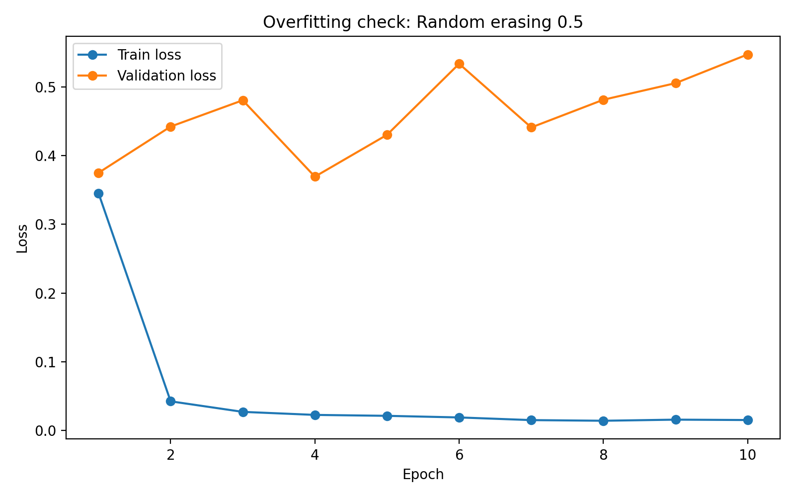

### Interpretation & Further Steps

We generally believe that our one-at-a-time evaluation design allowed us to successfully assess the effects of the different image augmentation approaches. 
Structurally altering the training images (random erasure and cropping) helped mitigate overfitting, while the effects of modifying color were insignificant. 
We would argue that this could have been expected given the domain and classification task. 

Consistent overfitting across configurations suggests that one of the main challenges of this task is the fairly small set of 26 individual drivers, with inherent dependencies between images of the same driver. 
We believe that simple augmentations like those employed here are likely not sufficient to solve this.
To further strengthen the models' generalizability in the domain, we would likely need either a more diverse training set or a higher degree of regularization such as stronger dropouts or weight decay tuning.

We also find that the fully augmented model does not effectively combine benefits of each individual augmentation, seen by its validation loss of approximately 0.315 being slightly worse than that of random erasure alone at approximately 0.308. Potential interaction effects or augmentation noise might negatively influence the combined performance. 

We would be interested in testing these experiments further. The most approachable next step would be to implement longer training with early stopping instead of fixing the number of epochs at 10. Similarly, we could check the effects of even stronger augmentation parameters, especially for those methods initially seen as effective, e.g., by applying a higher erasing probability or a larger crop range. We would also consider freezing the model's backbone and only fine-tuning the head to potentially reduce the capacity for memorization of the environments. Lastly, as we observed fairly high noise in the validation loss curves, more folds or repeated cross-validation could be employed to reduce variance in the estimates.  

## Reproduce our Results

If you wish to reproduce our results, follow the below steps:

1. **Install Python 3.13** from [python.org](https://www.python.org/downloads/) if not already installed.

2. **Clone the repository** and navigate to the project root:

   ```bash
   git clone https://github.com/sanderengel/aml_mini_project
   cd aml_mini_project
   ```

3. **Create and activate a virtual environment:**

   ```bash
   python3.13 -m venv .venv
   ```

   macOS/Linux:
   
   ```bash
   source .venv/bin/activate
   ```
   
   Windows:
   
   ```powershell
   .venv\Scripts\activate 
   ```

4. **Install dependencies:**

   ```bash
   pip install -r requirements.txt
   ```

5. **Access the data** at [Kaggle](https://www.kaggle.com/competitions/state-farm-distracted-driver-detection/data) by logging in (or creating an account) and registering for a late submission to the challenge. Download and unzip the data into `data/state-farm-distracted-driver-detection/` such that the directory structure matches ours. Note that the training set is around 1GB.

6. Run our training pipeline with the below command. 

   ```bash
   python trainer.py
   ```

   Note that if running locally, this will require substantial computational resources and time. To verify the setup with a quick test first, instead run:

   ```bash
   python trainer.py --test
   ```

## References

[1] He, K., Zhang, X., Ren, S., & Sun, J. (2015). *Deep Residual Learning for Image Recognition*. arXiv:1512.03385. https://arxiv.org/abs/1512.03385

[2] Kingma, D. P., & Ba, J. (2014). *Adam: A Method for Stochastic Optimization*. Published at ICLR 2015. arXiv:1412.6980. https://arxiv.org/abs/1412.6980

[3] Zhong, Z., Zheng, L., Kang, G., Li, S., & Yang, Y. (2017). *Random Erasing Data Augmentation*. arXiv:1708.04896. https://arxiv.org/abs/1708.04896

## Authors

Lukas Ditlevsen
<br>
_lukd@itu.dk_

Sander Engel Thilo
<br>
_saet@itu.dk_

**IT University of Copenhagen**

_This project was made for the Advanced Machine Learning course at ITU, 2026._

