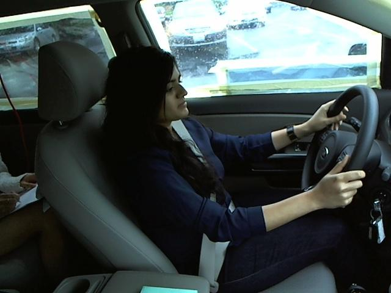
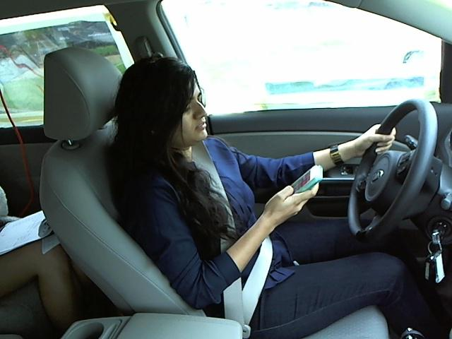
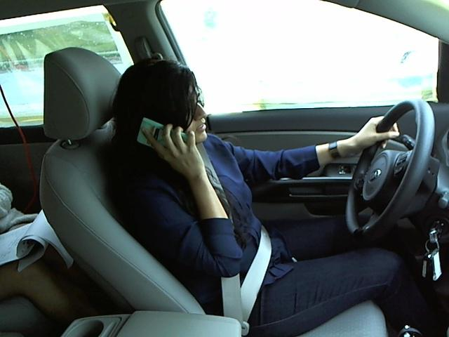
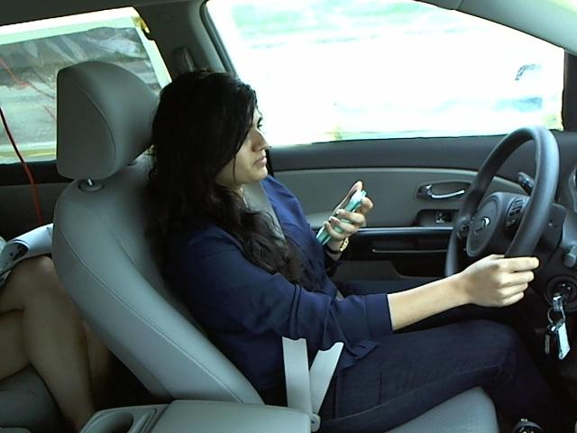
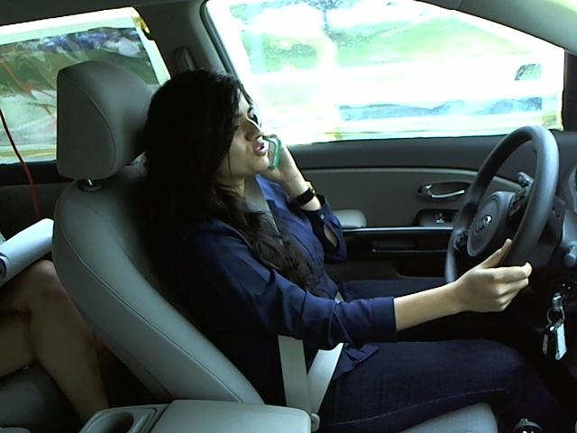
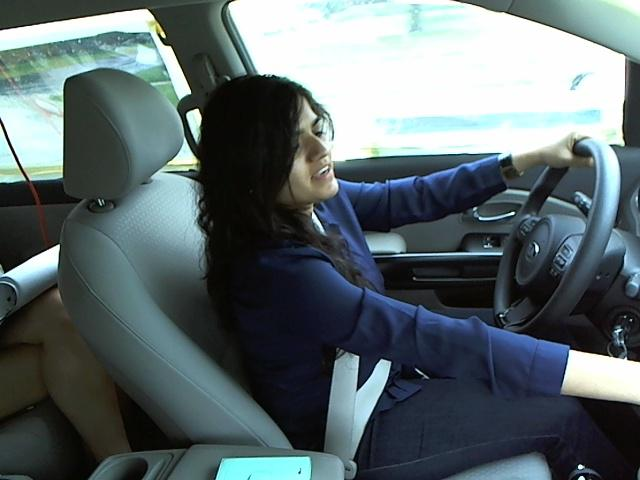
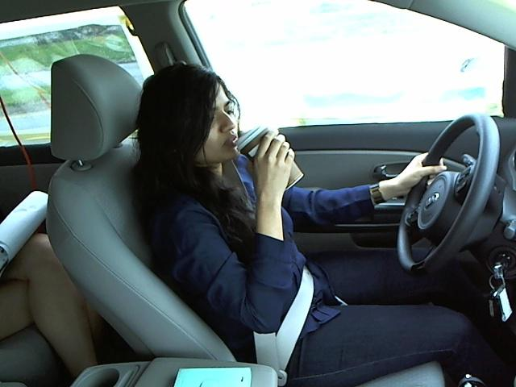
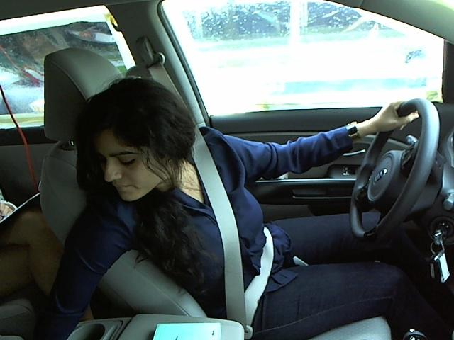
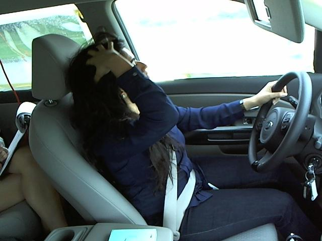
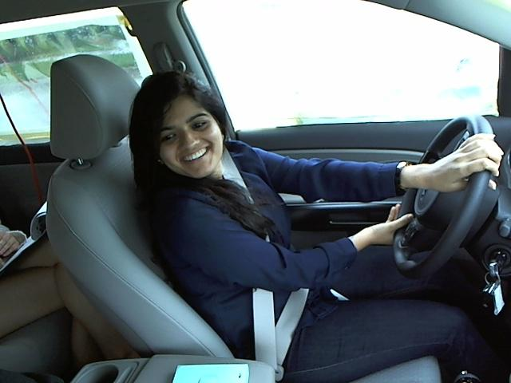

# Augmentation Effects on Distracted Driver Detection

Inspired by State Farm's [Distracted Driver Detection Challenge](https://www.kaggle.com/competitions/state-farm-distracted-driver-detection/data), we build a system to classify images of drivers into 10 classes categorized by the drivers' activities while behind the wheel. 

## Scope and Purpose

When initially inspecting the data, we hypothesized that a main issue for many modern classification models would be overfitting to the training data by building reliances on environmental characterics such as car interiors or driver-specific attributes, rather than capturing actual generalizable signal from driver activities. As such, our focus for this project is to assess whether we can regularize for this, augmenting the training images in different ways to effectively deter the model from relying on the image environments. 

## Data

We utilize data provided for the State Farm challenge: a training set of 22,434 images of drivers taken from the interior of the car. 
The data is produced from controlled experiments where cars are being pulled by a truck, allowing 26 individual participants to pretend to drive a car while engaging in activities according to the 10 classes. 
This means that, while the dataset is large, many of the observations are not independent, essentially existing in 26 separate groups defined by common drivers and car interiors. 

The challenge also provides an even larger test dataset, but as this is without labels, includes an unknown number of processed docey images, and mostly only useful for predictions to obtain a leaderboard score for the challenge, we omit the use of this set for our analysis. 
Our focus is inherently a task of comparising different data processing approaches, and we thus find it sufficient to rely on cross-validation metrics to assess differences. 

### Labels

The training data is categorized into 10 distinct activity classes:

|Class Code|Class Description|# Observations|
|---|---|---|
|c0|safe driving|2489|
|c1|texting - right|2267|
|c2|talking on the phone - right|2317|
|c3|texting - left|2346|
|c4|talking on the phone - left|2326|
|c5|operating the radio|2312|
|c6|drinking|2325|
|c7|reaching behind|2002|
|c8|hair and makeup|1911|
|c9|talking to passenger|2129|

We observe that the label distribution is sufficiently balanced for us to assume cross-entropy loss and accuracy will serve as meaningful metrics without class weighting or resampling. 

**Examples:**

<table>
  <tr>
    <td align="center"> c0: safe driving</td>
    <td align="center"> c1: texting - right</td>
    <td align="center"> c2: talking on phone - right</td>
    <td align="center"> c3: texting - left</td>
    <td align="center"> c4: talking on phone - left</td>
  </tr>
  <tr>
    <td align="center"> c5: operating radio</td>
    <td align="center"> c6: drinking</td>
    <td align="center"> c7: reaching behind</td>
    <td align="center"> c8: hair and makeup</td>
    <td align="center"> c9: talking to passenger</td>
  </tr>
</table>

## Authors

Lukas Ditlevsen
 
_lukd@itu.dk_

Sander Engel Thilo
 
_saet@itu.dk_

**IT University of Copenhagen**

_This project was made for the Advanced Machine Learning course at ITU, 2026._

